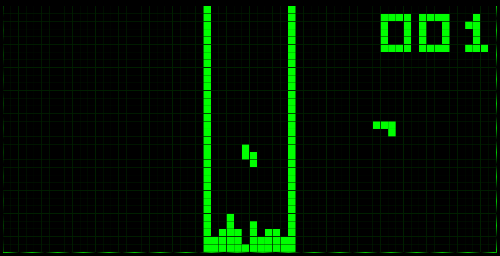

# tetris_reassembled_ch8

This project is a modded rom of the [1991 chip8 tetris rom from Fran Dachille](https://github.com/kripod/chip8-roms). It was disassembled with a [custom disassembler](https://github.com/r-downing/chip8asm) into a basic assembly language, which could then be modified and reassembled.

Download the rom here: [tetris_reassembled.ch8](https://r-downing.github.io/tetris_reassembled_ch8/tetris_reassembled.ch8)

## Enhancements

- Faster line-checking and clearing with 5x1 sprite
- More responsive controls - removed busy-loop after button-presses, support rapid button tapping with hold-checking
- Blocks spawn in random orientation
- Add preview view of next block
- add separate button controls for instant-dropping vs moving down a few rows

